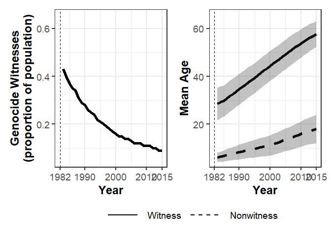
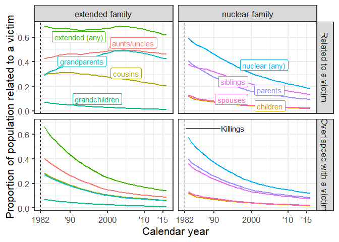
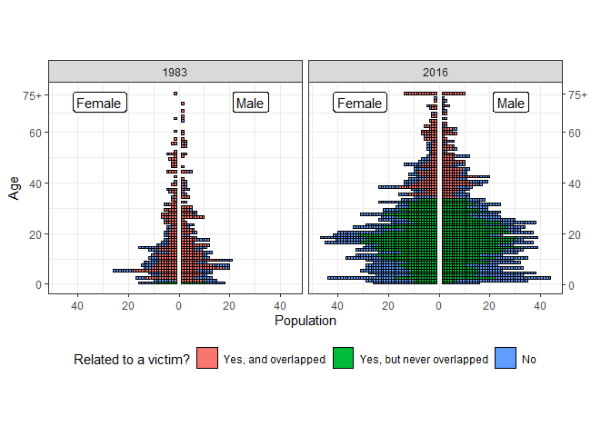

Reproducible materials
================
Diego Alburez-Gutierrez

  - [Structure of the data](#structure-of-the-data)
  - [Reproducing results from the
    paper](#reproducing-results-from-the-paper)
      - [Table 1](#table-1)
          - [Define parameters](#define-parameters)
          - [Define functions](#define-functions)
          - [Run analysis](#run-analysis)
      - [Table 2](#table-2)
          - [Define parameters](#define-parameters-1)
          - [Define functions](#define-functions-1)
          - [Run analysis](#run-analysis-1)
      - [Table 3](#table-3)
          - [Define parameters](#define-parameters-2)
      - [Run analysis](#run-analysis-2)
      - [Figure 1](#figure-1)
          - [Define parameters](#define-parameters-3)
          - [Define functions](#define-functions-2)
          - [Run analysis](#run-analysis-3)
      - [Figure 3](#figure-3)
          - [Define parameters](#define-parameters-4)
          - [Define functions](#define-functions-3)
          - [Run analysis](#run-analysis-4)
      - [Figure 4](#figure-4)
          - [Define parameters](#define-parameters-5)
          - [Define functions:](#define-functions-4)
          - [Run analysis](#run-analysis-5)
  - [Session information](#session-information)

This document presents the code needed to reproduce the empirical
analysis, figures, and tables presented in the paper:

Alburez-Gutierrez, D. (accepted). *The demographic drivers of grief and
memory after genocide in Guatemala.* Demography. Temporary DOI:
<https://dx.doi.org/10.4054/MPIDR-WP-2021-003>.

The package `EGM` is needed to reproduce the results of this study. It
can be downloaded from Github using the `devtools` package in R:

``` r
  library(devtools)
  install_github("alburezg/EGM", dep = FALSE)
```

After installation, the package can be loaded, together with the other
packages needed for the analysis (see version numbers and other
technical details at the end of this document):

``` r
library(EGM)

library(tidyverse)
```

    ## Warning: package 'tidyverse' was built under R version 4.0.4

    ## -- Attaching packages --------------------------------------- tidyverse 1.3.0 --

    ## v ggplot2 3.3.3     v purrr   0.3.4
    ## v tibble  3.1.0     v dplyr   1.0.5
    ## v tidyr   1.1.3     v stringr 1.4.0
    ## v readr   1.4.0     v forcats 0.5.1

    ## Warning: package 'ggplot2' was built under R version 4.0.4

    ## Warning: package 'tibble' was built under R version 4.0.4

    ## Warning: package 'readr' was built under R version 4.0.4

    ## Warning: package 'purrr' was built under R version 4.0.4

    ## Warning: package 'stringr' was built under R version 4.0.4

    ## Warning: package 'forcats' was built under R version 4.0.4

    ## -- Conflicts ------------------------------------------ tidyverse_conflicts() --
    ## x dplyr::filter() masks stats::filter()
    ## x dplyr::lag()    masks stats::lag()

``` r
library(knitr)
```

    ## Warning: package 'knitr' was built under R version 4.0.4

``` r
library(kableExtra)
```

    ## Warning: package 'kableExtra' was built under R version 4.0.4

    ## 
    ## Attaching package: 'kableExtra'

    ## The following object is masked from 'package:dplyr':
    ## 
    ##     group_rows

``` r
library(ggrepel)
```

    ## Warning: package 'ggrepel' was built under R version 4.0.4

``` r
library(patchwork)
```

    ## Warning: package 'patchwork' was built under R version 4.0.4

# Structure of the data

The microdata data from Rio Negro cannot be shared in full given privacy
concerns. The raw data includes sensitive information such as date of
birth, date of death, and kinship ties, which could be used to uniquely
identify members of the population. Nevertheless, this section provides
a brief overview of the seven datasets referenced in the code below.
Note that the datasets included in the EGM package are for illustrative
purposes and only include the columns referenced in the analysis.

The `final` dataset records all members of the community, reconstructed
using the EGM method. It is the consolidated and deduplicated version of
the `ind.q` dataset.

``` r
EGM::final %>% head %>% kable
```

<table>

<thead>

<tr>

<th style="text-align:right;">

ind\_id

</th>

<th style="text-align:left;">

id\_cuest

</th>

<th style="text-align:right;">

DoD

</th>

<th style="text-align:right;">

DoD\_with\_alive

</th>

<th style="text-align:right;">

DoB

</th>

<th style="text-align:right;">

alive

</th>

<th style="text-align:left;">

died\_conflict

</th>

<th style="text-align:right;">

sex

</th>

<th style="text-align:left;">

sex2

</th>

<th style="text-align:left;">

origin\_literal

</th>

<th style="text-align:left;">

origin\_departamento

</th>

<th style="text-align:left;">

origin\_local

</th>

<th style="text-align:left;">

parents

</th>

<th style="text-align:right;">

father

</th>

<th style="text-align:right;">

mother

</th>

<th style="text-align:left;">

spouses

</th>

<th style="text-align:left;">

children

</th>

<th style="text-align:left;">

cousins

</th>

<th style="text-align:left;">

grandparents

</th>

<th style="text-align:left;">

grandchildren

</th>

</tr>

</thead>

<tbody>

<tr>

<td style="text-align:right;">

1

</td>

<td style="text-align:left;">

1\_1;3\_24;33\_30

</td>

<td style="text-align:right;">

NA

</td>

<td style="text-align:right;">

2016

</td>

<td style="text-align:right;">

1954

</td>

<td style="text-align:right;">

1

</td>

<td style="text-align:left;">

FALSE

</td>

<td style="text-align:right;">

2

</td>

<td style="text-align:left;">

Female

</td>

<td style="text-align:left;">

1

</td>

<td style="text-align:left;">

baja verapaz

</td>

<td style="text-align:left;">

TRUE

</td>

<td style="text-align:left;">

8;9

</td>

<td style="text-align:right;">

8

</td>

<td style="text-align:right;">

9

</td>

<td style="text-align:left;">

2

</td>

<td style="text-align:left;">

3;120;121

</td>

<td style="text-align:left;">

NA

</td>

<td style="text-align:left;">

NA

</td>

<td style="text-align:left;">

4;60;122;3507;123

</td>

</tr>

<tr>

<td style="text-align:right;">

2

</td>

<td style="text-align:left;">

1\_2;3\_25;33\_36

</td>

<td style="text-align:right;">

1984

</td>

<td style="text-align:right;">

1984

</td>

<td style="text-align:right;">

1939

</td>

<td style="text-align:right;">

0

</td>

<td style="text-align:left;">

FALSE

</td>

<td style="text-align:right;">

1

</td>

<td style="text-align:left;">

Male

</td>

<td style="text-align:left;">

coban

</td>

<td style="text-align:left;">

alta verapaz

</td>

<td style="text-align:left;">

FALSE

</td>

<td style="text-align:left;">

</td>

<td style="text-align:right;">

NA

</td>

<td style="text-align:right;">

NA

</td>

<td style="text-align:left;">

1

</td>

<td style="text-align:left;">

3;120;121

</td>

<td style="text-align:left;">

NA

</td>

<td style="text-align:left;">

NA

</td>

<td style="text-align:left;">

4;60;122;3507;123

</td>

</tr>

<tr>

<td style="text-align:right;">

3

</td>

<td style="text-align:left;">

1\_3;3\_26;33\_37;34\_49;25\_3

</td>

<td style="text-align:right;">

NA

</td>

<td style="text-align:right;">

2016

</td>

<td style="text-align:right;">

1976

</td>

<td style="text-align:right;">

1

</td>

<td style="text-align:left;">

FALSE

</td>

<td style="text-align:right;">

2

</td>

<td style="text-align:left;">

Female

</td>

<td style="text-align:left;">

1

</td>

<td style="text-align:left;">

baja verapaz

</td>

<td style="text-align:left;">

TRUE

</td>

<td style="text-align:left;">

2;1

</td>

<td style="text-align:right;">

2

</td>

<td style="text-align:right;">

1

</td>

<td style="text-align:left;">

5;7

</td>

<td style="text-align:left;">

4;60;122;123

</td>

<td style="text-align:left;">

24;3;50;25;51;3159;75;2199;468;79;85;2200;80;86;81;87;82;76;88;83;89;84;90

</td>

<td style="text-align:left;">

8;9

</td>

<td style="text-align:left;">

47

</td>

</tr>

<tr>

<td style="text-align:right;">

4

</td>

<td style="text-align:left;">

1\_4;33\_41;34\_55;3\_28

</td>

<td style="text-align:right;">

NA

</td>

<td style="text-align:right;">

2016

</td>

<td style="text-align:right;">

1996

</td>

<td style="text-align:right;">

1

</td>

<td style="text-align:left;">

FALSE

</td>

<td style="text-align:right;">

2

</td>

<td style="text-align:left;">

Female

</td>

<td style="text-align:left;">

2

</td>

<td style="text-align:left;">

baja verapaz

</td>

<td style="text-align:left;">

TRUE

</td>

<td style="text-align:left;">

7;3

</td>

<td style="text-align:right;">

7

</td>

<td style="text-align:right;">

3

</td>

<td style="text-align:left;">

6

</td>

<td style="text-align:left;">

47

</td>

<td style="text-align:left;">

4;3507;1538;1539;1540;1541

</td>

<td style="text-align:left;">

484;1542;2;1

</td>

<td style="text-align:left;">

NA

</td>

</tr>

<tr>

<td style="text-align:right;">

5

</td>

<td style="text-align:left;">

1\_5;3\_27;33\_44;34\_58

</td>

<td style="text-align:right;">

NA

</td>

<td style="text-align:right;">

2016

</td>

<td style="text-align:right;">

1974

</td>

<td style="text-align:right;">

1

</td>

<td style="text-align:left;">

FALSE

</td>

<td style="text-align:right;">

1

</td>

<td style="text-align:left;">

Male

</td>

<td style="text-align:left;">

canchun

</td>

<td style="text-align:left;">

baja verapaz

</td>

<td style="text-align:left;">

FALSE

</td>

<td style="text-align:left;">

</td>

<td style="text-align:right;">

NA

</td>

<td style="text-align:right;">

NA

</td>

<td style="text-align:left;">

3

</td>

<td style="text-align:left;">

60;122;123

</td>

<td style="text-align:left;">

NA

</td>

<td style="text-align:left;">

NA

</td>

<td style="text-align:left;">

NA

</td>

</tr>

<tr>

<td style="text-align:right;">

6

</td>

<td style="text-align:left;">

1\_6;3\_29;33\_42;34\_56;44\_31

</td>

<td style="text-align:right;">

NA

</td>

<td style="text-align:right;">

2016

</td>

<td style="text-align:right;">

1993

</td>

<td style="text-align:right;">

1

</td>

<td style="text-align:left;">

FALSE

</td>

<td style="text-align:right;">

1

</td>

<td style="text-align:left;">

Male

</td>

<td style="text-align:left;">

2

</td>

<td style="text-align:left;">

baja verapaz

</td>

<td style="text-align:left;">

TRUE

</td>

<td style="text-align:left;">

371;178

</td>

<td style="text-align:right;">

371

</td>

<td style="text-align:right;">

178

</td>

<td style="text-align:left;">

4

</td>

<td style="text-align:left;">

47

</td>

<td style="text-align:left;">

2720;2712;2721;6;2714;419;420;2713;421;2715;422;2716;423;2717;2718;2719

</td>

<td style="text-align:left;">

368;361;172;97

</td>

<td style="text-align:left;">

NA

</td>

</tr>

</tbody>

</table>

# Reproducing results from the paper

In what follows, I show how these datasets were analysed to produce the
results reported in the paper. Note that the code will not work using
only the sample datasets included in the EGM package. Researchers
interested in replicating any particular section of the analysis are
encouraged to contact the author.

## Table 1

### Define parameters

``` r
war_year <- 1982

death_year_min <- 1983
birth_year_min <- 1982
  
custom_interval <- c(0,15,45)
levels_ordered <- c("0 to 14", "15 to 44", "45+")
levels_custom <-  c("15 to 44", "0 to 14",  "45+")

cos <- war_year - custom_interval

cos_labs <- c(
      paste0(cos[2]+1, "-", cos[1])
      , paste0(cos[3], "-", cos[2])
      , paste0("Pre-",cos[3])
      , "All cohorts"
    )
```

### Define functions

``` r
format_zero_table <- function(x) gsub("^0\\.", ".", x)

census <- function(df, from, to = NA, subset_df = T, born_in_RN = F, born_bv = F,
                   gen_age = T, women_only = F, men_only = F,
                   by = 5, update_relatives = T, show_messages = F,
                   subset_on_DoB = F, min_DoB, max_DoB) {
  # If subset_df, it returns a DF with only the relevant cases
  # Otherwise, it will create a column 'keep' to indicate which values should be kept.
  if (is.na(to)) to <- from
  # keep only cases where dates are known
  # set DoD of alive people as 2010
  if (from == to) df$census <- from
  else df$census <- paste(from,to,sep = "-")
  df$DoD_temp <- df$DoD
  df$DoD_temp[df$alive == 1] <- 2100

  if (born_in_RN) df <- dplyr::filter(df, origin_literal == 1)

  if (born_bv) df <- dplyr::filter(df, origin_departamento == "baja verapaz")

  if (women_only) df <- df %>% dplyr::filter(sex == 2)

  if (men_only) df <- df %>% dplyr::filter(sex == 1)

  if (subset_df) {
    df <- df[!is.na(df$DoB) & !is.na(df$DoD_temp),]
    DoD <- df$DoD_temp
    df$DoD_temp <- NULL
    DoB <- df$DoB
    # keep only those alive in given interval
    df <- df[DoB <= to & DoD >= from,]
  }
  else {
    DoD <- df$DoD_temp
    df$DoD_temp <- NULL
    DoB <- df$DoB
    df$keep <- NA
    df$keep <- ifelse(DoB <= to & DoD >= from, T, F)
  }
  if(subset_on_DoB) {
    # keep only those alive in given interval
    df <- df %>%
      dplyr::filter(DoB >= min_DoB & DoB <= max_DoB)
  }
  if (gen_age) {
    df$age_at_census <- round(mean(c(to,from))) - df$DoB
    df$age_gr_at_census <- age_group_custom(df$age_at_census, by = by, as_factor = T)
  }
  if (update_relatives) {
    # keep original copy
    df$children_original <- df$children
    df$father_original <- df$father
    df$mother_original <- df$mother
    df$parents_original <- df$parents
    df$cousins_original <- df$cousins
    df$grandparents_original <- df$grandparents
    df$granchildren_original <- df$grandchildren
    df$spouses_original <- df$spouses
    if (show_messages) {
      print("Columns substituted for all relative types.")
      print("Original values were saved in '[relative]_original' columns.")
      print("For spouses: Alive during census and older than 14.")
      print("For everyone else, alive during census.")
    }
  }
  return(df)
}
```

### Run analysis

``` r
 c_df <- 
    final %>%
    dplyr::filter(died_conflict & DoB <= birth_year_min) %>%
    dplyr::mutate(
      sex = sex2,
      age_conflict = ifelse(DoB <= war_year, war_year-DoB, NA),
      ag_conflict = cut(age_conflict, c(custom_interval, Inf), right = F, labels = F),
      ag_conflict = factor(plyr::mapvalues(ag_conflict, from = seq_along(levels_ordered), 
                                           to = levels_ordered), levels = levels_ordered)
    ) %>%
    group_by(ag_conflict, sex) %>%
    dplyr::summarise(n = n())
```

    ## `summarise()` has grouped output by 'ag_conflict'. You can override using the `.groups` argument.

``` r
# For census data
  
  all_df <-
    census(final, from = 1980, to = 1984) %>% 
    dplyr::filter(DoB <= birth_year_min) %>%
    dplyr::mutate(
      sex = sex2,
      age_conflict = ifelse(DoB <= war_year, war_year-DoB, NA),
      ag_conflict = cut(age_conflict, c(custom_interval, Inf), right = F, labels = F),
      ag_conflict = factor(plyr::mapvalues(ag_conflict, from = seq_along(levels_ordered), 
                                           to = levels_ordered), levels = levels_ordered)
    ) %>%
    group_by(ag_conflict, sex) %>%
    dplyr::summarise(n = n())
```

    ## `summarise()` has grouped output by 'ag_conflict'. You can override using the `.groups` argument.

``` r
  df <- merge(c_df, all_df, by = c("ag_conflict", "sex"))
  
  
  df$share <- (as.numeric(df$n.x)/df$n.y)
  
  df$ag_conflict <- factor(df$ag_conflict, levels = levels(all_df$ag_conflict))
  
  df2 <-
    df %>%
    select(ag_conflict, sex, b.total_original = n.y, c.total_died = n.x, d.share = share) %>%
    reshape(., idvar = "ag_conflict", timevar = "sex", direction = "wide") %>%
    select(
      ag_conflict, 
      original_female = b.total_original.Female, 
      original_male = b.total_original.Male,
      died_female = c.total_died.Female,
      died_male = c.total_died.Male,
      share_female = d.share.Female,
      share_male = d.share.Male
    ) %>%
    dplyr::mutate(
      original_all = original_female + original_male,
      died_all = died_female + died_male,
      share_all = rowMeans(.[ , c("share_female", "share_male") ] )
    ) %>%
    select(ag_conflict, original_all , original_female , original_male,
           died_all , died_female , died_male,
           share_all , share_female , share_male) %>%
    mutate_if(is.numeric, round, 2) %>%
    arrange(ag_conflict) %>%
    dplyr::mutate(ag_conflict = as.character(ag_conflict)) %>%
    data.frame
  
  newrow <- c("Total",colSums(df2[,2:ncol(df2)]))
  
  df3 <- rbind( df2,
                rbind(df2, newrow) %>%
                  dplyr::filter(ag_conflict == "Total") %>%
                  mutate_if(is.character, as.numeric) %>%
                  dplyr::mutate(
                    ag_conflict = "Total",
                    share_all = died_all / original_all *1,
                    share_female = died_female / original_female*1,
                    share_male = died_male / original_male*1
                  ) %>%
                  mutate_if(is.numeric, round, 2) %>%
                  data.frame
  )
```

    ## Warning in mask$eval_all_mutate(quo): NAs introduced by coercion

``` r
  em_df <- 
  data.frame(cos_labs) %>% 
  bind_cols(df3) %>% 
  mutate(ag_conflict = dplyr::recode(ag_conflict, "Total" = "All ages")) %>% 
  mutate(
    across(where(is.numeric), round, 2)
    , across(where(is.numeric), as.character)
    , across(everything(), format_zero_table)
  )
  
  em_df %>% 
    kable(
      format = "simple"
      , booktabs = T, label = "excess_mort"
      , col.names = c("","", rep(c("All", "Female", "Male"), 3))
      , caption = "Age-sex structure of the Rio Negro population before the 1982 killings and excess deaths from the killings. (A) Population by age and sex at the start of 1982; (B) direct deaths from the killings; (C) proportion of the pre-genocide population killed."
    ) %>% 
    kable_styling() %>% 
    add_header_above(c(
      "", "", "(A)" = 3
      , "(B)" = 3
      , "(C) = B/A" = 3
    )) %>% 
    add_header_above(c(
      "Cohort" = 1
      , "Age in 1982" = 1
      , "Alive in 1982" = 3
      , "Killed (total)" = 3
      , "Proportion killed" = 3
    ), line = F) 
```

    ## Warning in kable_styling(.): Please specify format in kable. kableExtra can
    ## customize either HTML or LaTeX outputs. See https://haozhu233.github.io/
    ## kableExtra/ for details.

    ## Warning in add_header_above(., c("", "", `(A)` = 3, `(B)` = 3, `(C) = B/A` =
    ## 3)): Please specify format in kable. kableExtra can customize either HTML or
    ## LaTeX outputs. See https://haozhu233.github.io/kableExtra/ for details.

    ## Warning in add_header_above(., c(Cohort = 1, `Age in 1982` = 1, `Alive in 1982`
    ## = 3, : Please specify format in kable. kableExtra can customize either HTML or
    ## LaTeX outputs. See https://haozhu233.github.io/kableExtra/ for details.

|             |          | All | Female | Male | All | Female | Male | All | Female | Male |
| ----------- | -------- | :-- | :----- | :--- | :-- | :----- | :--- | :-- | :----- | :--- |
| 1968-1982   | 0 to 14  | 544 | 273    | 271  | 163 | 82     | 81   | .3  | .3     | .3   |
| 1937-1967   | 15 to 44 | 332 | 170    | 162  | 147 | 75     | 72   | .44 | .44    | .44  |
| Pre-1937    | 45+      | 94  | 43     | 51   | 56  | 22     | 34   | .59 | .51    | .67  |
| All cohorts | All ages | 970 | 486    | 484  | 366 | 179    | 187  | .38 | .37    | .39  |

Age-sex structure of the Rio Negro population before the 1982 killings
and excess deaths from the killings. (A) Population by age and sex at
the start of 1982; (B) direct deaths from the killings; (C) proportion
of the pre-genocide population killed.

## Table 2

### Define parameters

``` r
br <- c(0, 15, 45, Inf)

rel_old <- c(
  "nuclear", "children", "parents", "siblings", "spouses"
  , "extended", "grandchildren", "grandparents", "cousins"
  )


rel_new <- c(
  "Nuclear (any)", "Children", "Parents", "Siblings", "Spouses"
  , "Extended (any)", "Grandchildren", "Grandparents", "Cousins"
) 
```

### Define functions

``` r
create_age_groups <- function(df, col_in, br = c(0, 15, 45, Inf), include.lowest = T, col_out = "ag"){
  new <- cut(df[, col_in], br, include.lowest = include.lowest)
  df[, col_out] <- new
  df
}
```

### Run analysis

``` r
expo_all <- 
  census(final, 1983) %>% 
  create_age_groups(col_in = "age_at_census", br = br) %>% 
  select(
    sex = sex2, ag, nuclear = c_index_nuclear, extended = c_index_extended
    , ends_with("_death"), -age_death
  ) %>% 
  pivot_longer(-c(sex, ag)) %>% 
  mutate(name = gsub("_death", "", name))

# Fix error
expo_all$value[expo_all$ag == "[0,15]" & expo_all$name == "grandchildren"] <- 0

expo <-
  expo_all %>% 
  group_by(sex, ag, name) %>% 
  summarise(
    sd = sd(value, na.rm = T)
    , value = mean(value, na.rm = T)
    ) %>% 
  ungroup() %>% 
  mutate(
    pretty = paste0(hide0(round(value, 1)), " (", hide0(round(sd, 1)), ")")
    ) %>% 
  select(-sd)
```

    ## `summarise()` has grouped output by 'sex', 'ag'. You can override using the `.groups` argument.

``` r
expo %>% 
  mutate(
    name = plyr::mapvalues(name, rel_old, rel_new)
    , name = factor(name, levels = rel_new)
  ) %>% 
  select(-value) %>% 
  pivot_wider(names_from = c(sex, ag), values_from = pretty) %>% 
  arrange(name) %>% 
  kable(
    format = "pipe"
      , booktabs = T
    , caption = "Number of relatives lost by sex and age of genocide survivors at the time of the killings (mean and standard deviation)."
    , label = "kin_loss_mean"
    , col.names = c(" ", "F 0-14", "F 15-44", "F 45+",  "M 0-14", "M 15-44", "M 45+")
  ) 
```

|                | F 0-14    | F 15-44   | F 45+     | M 0-14    | M 15-44   | M 45+     |
| :------------- | :-------- | :-------- | :-------- | :-------- | :-------- | :-------- |
| Nuclear (any)  | 1.2 (1.7) | 2.9 (3.2) | 3.5 (3.1) | 1.4 (1.7) | 2.9 (2.8) | 3.2 (3.3) |
| Children       | 0 (.1)    | .5 (1.2)  | 1.8 (1.6) | 0 (.1)    | .7 (1.3)  | 1.8 (2.1) |
| Parents        | .8 (.7)   | .8 (.8)   | .6 (.8)   | .8 (.7)   | .9 (.7)   | .4 (.7)   |
| Siblings       | .6 (1.3)  | 1.7 (2.5) | 1 (1.3)   | .8 (1.3)  | 1.4 (1.7) | .9 (2.1)  |
| Spouses        | 0 (.1)    | .2 (.4)   | .5 (.5)   | 0 (0)     | .2 (.4)   | .3 (.5)   |
| Extended (any) | 3.8 (5.4) | 4.9 (5.3) | 6.1 (5.4) | 4.5 (5.5) | 4.6 (5.1) | 5.8 (6.3) |
| Grandchildren  | 0 (0)     | .3 (.8)   | 2.6 (3.8) | 0 (0)     | .2 (.8)   | 2.7 (3.7) |
| Grandparents   | .7 (1)    | .3 (.7)   | 0 (0)     | .8 (1)    | .2 (.5)   | 0 (0)     |
| Cousins        | 2 (3.9)   | 1.4 (3.5) | 0 (0)     | 2.3 (4)   | 1.3 (3.6) | 0 (0)     |

Number of relatives lost by sex and age of genocide survivors at the
time of the killings (mean and standard deviation).

## Table 3

### Define parameters

``` r
deaths_keep <- 1:5

col_kin <- c(
  "nuclear (any)"
  , "children", "parents", "siblings", "spouses"
  , "extended (any)"
  , "grandchildren","grandparents", "cousins"
    )
```

## Run analysis

``` r
pop_temp <- 
  census(final, 1982) %>%
  dplyr::filter(!died_conflict) %>%
  mutate(
    died_other = ifelse(alive == 0 & !died_conflict, T, F)
    # THis creates some NAs, presumably for people whose current state is unknown
    # Assume they are dead, for convenience
    , died_other = ifelse(is.na(died_other), T, F)
  )


prog_df <-
  pop_temp %>% 
  select(
    tidyselect::ends_with("_death")
    , `extended (any)` = c_index_extended, `nuclear (any)` = c_index_nuclear
    ) %>% 
  select(contains(col_kin)) %>% 
  pivot_longer(everything(), names_to = "kin", values_to = "deaths") %>% 
  mutate(
    kin = gsub("_death", "", kin)
    # Some issue with codinf for parents
    , deaths = ifelse(is.na(deaths), 0, deaths)
    ) %>% 
  count(kin, deaths) %>% 
  tidyr::complete(kin, deaths, fill = list(n = 0)) %>% 
  filter(!is.na(deaths)) %>% 
  group_by(kin) %>% 
  # n is number of poeople who had at least x deaths
  mutate(
    # People who experienced x or more deaths
    # This is estimated like Tx in a life table
    risk = rev(cumsum(rev(n))) 
    , prog = risk / lag(risk)
    , prog = ifelse(is.nan(prog), NA, prog)
    , percent = round(prog * 100, 1)
  ) %>% 
  ungroup() %>% 
  data.frame()


prog_df %>% 
  filter(deaths %in% deaths_keep) %>%
  select(kin, deaths, risk, prob = prog) %>% 
  mutate(
    kin = factor(kin, levels = col_kin)
    , deaths = paste0(deaths-1, " to ", deaths, "+")
    , prob = ifelse(kin == "parents" & deaths == 3, NA, prob)
    , prob = ifelse(is.na(prob), "", round(prob, 2))
    , out = paste0(prob, " [", risk, "]")
    , out = gsub("^0\\.", ".", out)
    ) %>% 
  filter(prob > 0) %>% 
  arrange(kin) %>% 
  pivot_wider(-c(risk, prob), names_from = deaths, values_from = out, values_fill = list(out = "")) %>% 
  mutate(kin = str_to_title(kin)) %>% 
  rename(`(n-1) to n+` = kin) %>% 
  kable(
    .
    , format = "simple"
    , booktabs = T, escape = F
    , caption = "Proportion of genocide survivors who experienced the death of $n$ or more relatives ($n+$), conditional on having experienced the death of at least $(n-1)$ relatives. In square brackets, population who experienced at least $n$ deaths of a given relative type."
    , label = "bpr"
    ) 
```

| (n-1) to n+    | 0 to 1+     | 1 to 2+     | 2 to 3+     | 3 to 4+     | 4 to 5+     |
| :------------- | :---------- | :---------- | :---------- | :---------- | :---------- |
| Nuclear (Any)  | .59 \[354\] | .68 \[239\] | .79 \[188\] | .63 \[119\] | .72 \[86\]  |
| Children       | .11 \[68\]  | .6 \[41\]   | .49 \[20\]  | .35 \[7\]   | .71 \[5\]   |
| Parents        | .42 \[250\] | .28 \[71\]  |             |             |             |
| Siblings       | .38 \[228\] | .71 \[162\] | .67 \[108\] | .47 \[51\]  | .49 \[25\]  |
| Spouses        | .07 \[44\]  |             |             |             |             |
| Extended (Any) | .66 \[397\] | .86 \[342\] | .91 \[312\] | .83 \[259\] | .84 \[217\] |
| Grandchildren  | .08 \[45\]  | .69 \[31\]  | .65 \[20\]  | .65 \[13\]  | .69 \[9\]   |
| Grandparents   | .28 \[170\] | .62 \[105\] | .3 \[32\]   | .03 \[1\]   |             |
| Cousins        | .29 \[173\] | .91 \[158\] | .78 \[124\] | .76 \[94\]  | .98 \[92\]  |

Proportion of genocide survivors who experienced the death of \(n\) or
more relatives (\(n+\)), conditional on having experienced the death of
at least \((n-1)\) relatives. In square brackets, population who
experienced at least \(n\) deaths of a given relative type.

## Figure 1

### Define parameters

``` r
# For data wrangling

awareness_ages <- c(5, 12)

# For plot

y_br_small <- c(1982, 1990, 2000, 2010, 2015)

l1 <- "Genocide witnesses\n(proportion of population)"
l2 <- "Mean age"

lab_df <- data.frame(
  year = c(1995, 2005)
  , value = c(14, 40)
  , type = c(l1, l2)
)
```

### Define functions

``` r
# Given a type of relative and awareness age, determine the share
# of witnesses in a populatio over time, or the share of pop with 
# a victim from the genocide
get_witness_df <- function(family_type, awareness_age){
  
  # Parameters
  relatives <- switch (family_type,
                       nuclear = c("father", "mother", "siblings", "children", "spouses")
                       , extended = c("father", "mother", "siblings", "children", "spouses", "cousins", "grandparents", "grandchildren", "uncles")
                       , parents = c("father", "mother")
  )
  
  year_range <- 1982:2016
  
  death_year_min <- 1983
  birth_year_min <- 1982
  
  war_year <- 1982
  
  age_br <- c(0, 15, 45, 100)
  
  birth_year_witness_min <- birth_year_min - awareness_age
  
  # 1. Get data
  
  everyone <- 
    final %>%
    select(
      ind_id, DoB, DoD, DoD_with_alive,alive, died_conflict, sex = sex2
      , father, mother, siblings, children, spouses
      , cousins, grandparents, grandchildren, uncles
    ) %>% 
    dplyr::mutate(
      age_conflict = ifelse(DoB <= war_year, war_year-DoB, NA),
      ag_conflict = cut(age_conflict, age_br, include.lowest = T)
    )
  
  # 1.1 First-hand witnesses
  
  alive_1982 <- 
    everyone %>% 
    dplyr::filter(DoB <= war_year) %>%
    dplyr::filter(DoD_with_alive >= war_year)
  
  # First-hand witness: alive in 1982 and older than awareness_age
  # years old at the time
  
  # Men and women
  witness1_ids <-
    alive_1982 %>% 
    dplyr::filter(DoB < birth_year_witness_min) %>%
    pull(ind_id)
  
  # Assign col to df to idenfify witnesses
  everyone$witness1 <-  everyone$ind_id %in% witness1_ids
  
  # Since weare ignoreing witness 2 here
  everyone$witness2 <-  F
  
  # Need a df BY YEAR
  witness_share <- get_pop_composition_witness(everyone,year_range)
  
  levs <- c("w1_w", "w2_w", "other_w")
  labs_wit <- c("No", "Second-hand", "First-hand")
  y_br <- c(1982, seq(1985, 2015, 5))
  
  share_df <- 
    witness_share %>% 
    pivot_longer(-year) %>% 
    filter(name %in% levs) %>% 
    mutate(name = factor(name, levels = rev(levs)))
  
  # 3 Mean age of witnesses
  
  # 3.1. Men and women together
  
  # Need a df BY YEAR
  witness_age <- get_mean_age_witness(everyone,year_range)
  
  levs_age <- c("w1", "w2", "other")
  labs_wit <- c("No", "Second-hand", "First-hand")
  y_br <- c(1982, seq(1985, 2015, 5))
  
  age_df <- 
    witness_age %>% 
    pivot_longer(-year) %>% 
    mutate(
      status = gsub("_mean|_sd", "", name)
      , measure = gsub("w1_|w2_|other_", "", name)
    )  %>% 
    select(-name) %>% 
    pivot_wider(names_from = measure, values_from = value) %>% 
    mutate(
      low = mean - sd*0.5
      , high = mean + sd*0.5
    ) %>% 
    mutate(status = factor(status, levels = rev(levs_age))) 
  
  both_survivors <- 
    bind_rows(
      share_df %>%
        mutate(
          status = gsub("_w", "", name)
          , status = factor(status, levels = rev(levs_age))
          , type = "Share of population"
        ) %>% 
        select(year, status, value, type)
      , age_df %>% 
        select(year, status, value = mean, age_low = low, age_high = high) %>% 
        mutate(
          type = "Mean Age"
          , status = factor(status, levels = rev(levs_age))
        )
    ) %>% 
    mutate(type = factor(type, levels = c("Share of population", "Mean Age")))
  
  return(both_survivors)
}

# For plots of witness survival
get_pop_composition_witness <- function(everyone, year_range){
  
  out <- 
    lapply(year_range, function(y, everyone){
      df <- census(everyone, y)
      # unweighted
      w1 <- sum(df$witness1) 
      w2 <- sum(df$witness2) 
      other <- sum(!df$witness1 & !df$witness2) 
      # weighted
      w1_w <- w1 / nrow(df)
      w2_w <- w2 / nrow(df)
      other_w <- other / nrow(df)
      # return
      data.frame(year = y, w1, w2, other, w1_w, w2_w, other_w)
    }, everyone)  %>% 
    bind_rows()
  out  
}

# For plots of witness survival
get_mean_age_witness <- function(everyone, year_range){
  
  df_temp <-
    everyone %>% 
    mutate(
      status = ifelse(witness1, "w1", "other")
      , status = ifelse(witness2, "w2", status)
    )
  
  out <- 
    lapply(year_range, function(y, df_temp){
      
      census(df_temp, y) %>% 
        group_by(status) %>% 
        summarise(
          mean = mean(age_at_census, na.rm = T)
          , sd = sd(age_at_census, na.rm = T)
        ) %>% 
        ungroup() %>% 
        pivot_longer(-status) %>% 
        mutate(
          id = paste0(status,"_",name)
          , value = ifelse(is.na(value), 0, value)
        ) %>% 
        select(id, value) %>% 
        pivot_wider(names_from = id) %>% 
        mutate(year = y)
    }, df_temp)  %>% 
    bind_rows()
  out  
}
```

### Run analysis

``` r
both_survivors <- 
  get_witness_df(
  # Relative type to consider for estimating relatedness to victim
  family_type = "nuclear"
  # Minimum age at which we assume that survivors of the killings still 
  # remember
  , awareness_age = awareness_ages[2]
  ) 
```

Faceted plot

``` r
# Share
p_s <- 
  both_survivors %>% 
  filter(
    type == "Share of population"
    , status %in% c("w1")
  ) %>% 
  mutate(
    type = recode(
      type,  "Share of population" = l1, "Mean Age" = l2
    )
    , value = ifelse(type == l1, value*100, value)
    , value = round(value/100, 2)
  ) %>% 
  filter(year > 1982) %>% 
  ggplot() +
  # Age
  geom_line(
    aes(x = year, y = value, linetype = status)
    , show.legend = F
    , size = 2
  ) +
  geom_vline(xintercept = 1982, linetype = "dashed") +
  geom_text_repel(
    aes(x = year, y = value, label = label)
    , data = data.frame(year = 1982, value = 0.6, label = "Killings", type = l1)
    , size = 6
    , nudge_x = 13
  ) +
  scale_y_continuous(l1) +
  scale_x_continuous("Year", breaks = y_br_small) +
  scale_color_manual("", values = c("black", "red"), guide=FALSE) + 
  scale_fill_manual("", values = c("black", "red"), guide=FALSE) + 
  scale_linetype_manual("Experience of genocide", values = c(1:2), labels = c("Non-witness","Witness")) +
  coord_cartesian(ylim = c(0.05, 0.65)) + 
  theme_bw(base_size = 18) 

# Age
p_a <- 
  both_survivors %>% 
  filter(type == "Mean Age") %>% 
  mutate(
    type = recode(
      type,  "Share of population" = l1, "Mean Age" = l2
    )
    , value = ifelse(type == l1, value*100, value)
  ) %>% 
  filter(year > 1982) %>% 
  ggplot() +
  # Age
  geom_line(
    aes(x = year, y = value, linetype = status)
    # , show.legend = F
    , size = 2
  ) +
  # SurvWitness age bands
  geom_ribbon(
    aes(x = year, y = value, ymin = age_low, ymax = age_high)
    , alpha = 0.3, show.legend = F
    , data = . %>% filter(status %in% c("w1"))
  ) +
  # Non-Witness age bands
  geom_ribbon(
    aes(x = year, y = value, ymin = age_low, ymax = age_high)
    , alpha = 0.3, show.legend = F
    , data = . %>% filter(status %in% c("other"))
  ) +
  geom_vline(xintercept = 1982, linetype = "dashed") +
  scale_y_continuous(l2) +
  scale_x_continuous("Year", breaks = y_br_small) +
  scale_color_manual("", values = c("black", "red"), guide=FALSE) + 
  scale_fill_manual("", values = c("black", "red"), guide=FALSE) + 
  scale_linetype_manual("Experience of genocide", values = c(2:1), labels = c("Non-witness","Witness")) +
  coord_cartesian(ylim = c(5, 65)) + 
  theme_bw(base_size = 18) +
  guides(linetype = guide_legend(override.aes = list(size = 1)))

combined <- p_s + p_a & theme(legend.position = "bottom", legend.key.width = unit(2,"cm"))
combined + plot_layout(guides = "collect")
```

<!-- -->

## Figure 3

### Define parameters

``` r
war_year <- 1982

age_br <- c(0, 15, 45, 100)
y_br_small <- c(1982, 1990, 2000, 2010, 2015)
y_labs_small <- c(1982, "'90", 2000, "'10", "'15")

nuc <- c("parents", "siblings", "children", "spouses")
fam_levels <- c("nuclear family", "extended family")
knew_br <- c("met_relative","all", "did_not_meet_relative")
knew_levs <- c("Overlapped with a victim","Related to a victim", "No overlap")
```

### Define functions

``` r
get_df_share_bereaved_over_time <- function(condition = "all"){
  
  # General dfs
  
  everyone <- 
    final %>%
    select(
      ind_id, DoB, DoD, DoD_with_alive,alive, died_conflict, sex = sex2
      , father, mother, siblings, children, spouses
      , cousins, grandparents, grandchildren, uncles
    ) %>% 
    dplyr::mutate(
      age_conflict = ifelse(DoB <= war_year, war_year-DoB, NA),
      ag_conflict = cut(age_conflict, age_br, include.lowest = T)
    )
  

  # In order to determine whether the populations actually knew
  # (ie coexisted) with dead realtives, some filtering is required.
  # The trick is that these measure show all refer to the same
  # population, which is why filtering on population by date of
  # birth in here is unwise.
  year_range <- 1982:2016
  
  baseline_pop <- 
    everyone %>% 
    dplyr::filter(DoD_with_alive >= war_year) %>% 
    # add columns for each condition
    mutate(
      all = T
      , met_relative = ifelse(DoB <= war_year & DoD_with_alive >= war_year, T, F)
      # , did_not_meet_relative = ifelse(DoB > 1983 & DoD_with_alive >= war_year, T, F)
      , did_not_meet_relative = !met_relative
    )
  
  # Get all relative types
  rels <- list(
    parents = c("father", "mother"),
    siblings = "siblings", 
    children = "children", 
    spouses = "spouses", 
    cousins = "cousins", 
    grandparents = "grandparents", 
    grandchildren = "grandchildren", 
    uncles = "uncles",
    nuclear = c("father", "mother", "siblings", "children", "spouses"),
    extended = c("father", "mother", "siblings", "children", "spouses", "cousins", "grandparents", "grandchildren", "uncles")
  )
  
  
  share_df <- 
    lapply(seq_along(rels), function(n,condition){
      # print(n)
      col_name <- names(rels)[n]
      
      baseline_pop$has_a_relative_victim <- 
        check_if_any_relative_fulfils_condition(
          df = baseline_pop
          , ref = everyone
          , status_col = "died_conflict"
          , relatives = rels[[n]]
        )
      
      pop_share <- 
        get_pop_composition_relative_died(
          everyone = baseline_pop
          , year_range
          , col_name = col_name
          , condition
          )
      
      pop_share
      
    }, condition) %>% 
    bind_rows()
  # reduce(left_join, "year")
  
}

# FOr witness analysis
check_if_any_relative_fulfils_condition <- function(df, ref, status_col, relatives = c("father", "mother", "siblings", "children", "spouses")){
  # Create a column with all relatives pasted
  df_witnesses <- 
    df %>% 
    mutate(relatives = find_relatives(. , relatives)) %>% 
    select(ind_id, relatives, status = starts_with(status_col))
  
  # Now, loop over each element and find people who match the given 
  # status col criteria
  any_relative_fulfils_condition <- 
    lapply(df_witnesses$relatives, function(rel, ref){
      ids <- unlist(strsplit(rel, ";"))
      ids <- as.numeric(ids[!(ids == "NA"|is.na(ids))])
      relatives_status <- ref[ , status_col][match(ids,ref$ind_id )]  
      any(relatives_status)
    }, ref) %>% 
    unlist()
  return(any_relative_fulfils_condition)
}

# For any RN df, returns a vector with all requested relatives
find_relatives <- function(df, relatives){
  # Create a vector with all relevant ids of relative
  rel_df <- df[ , relatives] 
  if(!is.data.frame(rel_df)) rel_df <- as.data.frame(rel_df) # added on 15.10.2020
  rels <- NULL
  
  for(row in 1:nrow(rel_df)) {
    new <- unlist(rel_df[row,])
    # new[new == "NA"] <- NA
    new <- new[!is.na(new)]
    new_vec <- paste0(new, collapse = ";")
    rels[row] <- new_vec
  }
  
  rels[rels == ""] <- NA
  return(rels)
}

get_pop_composition_relative_died <- function(everyone, year_range, col_name, condition){
  
  out <- 
    lapply(year_range, function(y, everyone, condition){
      df <- census(everyone, y)
      # total number of bereaved people
      # filtered by condition!!
      pop <- sum(df[df[,condition], "has_a_relative_victim"]) 
      # weighted
      share <- pop / nrow(df)
      # return
      data.frame(year = y, pop, share)
    }, everyone, condition)  %>% 
    bind_rows() %>% 
    mutate(relative = col_name)
  out  
}
```

### Run analysis

``` r
share_are_bereaved_met <- 
  get_df_share_bereaved_over_time(condition = knew_br[1])

share_are_bereaved_all <- 
  get_df_share_bereaved_over_time(condition = knew_br[2])

share_are_bereaved_not_met <- 
  get_df_share_bereaved_over_time(condition = knew_br[3])

share_are_bereaved <- bind_rows(
   share_are_bereaved_met %>% mutate(knew = knew_levs[1])
   , share_are_bereaved_all %>% mutate(knew = knew_levs[2])
  , share_are_bereaved_not_met %>% mutate(knew = knew_levs[3])
) %>% 
  mutate(
    type = ifelse(relative %in% c(nuc, "nuclear"), "nuclear family", "extended family")
    , relative = recode(
      relative, 
      "nuclear"="nuclear (any)", "extended"="extended (any)"
      , "uncles" = "aunts/uncles"
      )
    , knew = factor(knew, levels = rev(knew_levs))
    , type = factor(type, levels = fam_levels)
  ) 
```

Plot

``` r
share_are_bereaved %>% 
  filter(year > 1982) %>% 
  filter(knew != knew_levs[3]) %>%
  ggplot() + 
  geom_line(
    aes(x = year, y = share, colour = relative)
    , size = 1
    , show.legend = F
    ) +
  geom_label_repel(
    aes(x = year, y = share, label = relative, colour = relative)
    , show.legend = F
    , data = . %>% filter(year == 2000, knew == knew_levs[2])
  ) +
  geom_text_repel(
    aes(x = year, y = share, label = label)
    , data = data.frame(
      year = 1982, share = 0.65, label = "Killings"
      , knew = knew_levs[1], type = fam_levels[1]
      )
    , nudge_x = 13
  ) +
  geom_vline(xintercept = 1982, linetype = "dashed") +
  scale_y_continuous("Proportion of population related to a victim") +
  scale_x_continuous("Calendar year", breaks = y_br_small, labels = y_labs_small) +
  facet_grid(factor(knew, levels = rev(knew_levs[-3])) ~ type, scales = "fixed") +
  theme_bw(base_size = 16)
```

<!-- -->

## Figure 4

### Define parameters

``` r
wit_br <- c("witness_met", "witness_not_met", "not_witness")
wit_labs <- c("Yes, and overlapped", "Yes, but never overlapped", "No")

min_age <- 0
max_age <- 75

br_y <- c(seq(0, max_age, 20), max_age)
labs_y <- br_y
labs_y[length(labs_y)] <- paste0(labs_y[length(labs_y)], "+")

filter_years <- c(1983, 2016)
```

### Define functions:

``` r
# Define function to get ggplot pyramid
get_witness_pyramid <- function(filter_year, wit_br, wit_labs, min_age, max_age){
  
  cell_scale <- 1
  war_year <- 1982
  
  # General dfs
  
  everyone <- 
    final %>%
    select(
      ind_id, DoB, DoD, DoD_with_alive,alive, died_conflict, sex = sex2
      , father, mother, siblings, children, spouses
      , cousins, grandparents, grandchildren, uncles
    ) 
  
  
  # In order to determine whether the populations actually knew
  # (ie coexisted) with dead realtives, some filtering is required.
  # The trick is that these measure show all refer to the same
  # population, which is why filtering on population by date of
  # birth in here is unwise.
  year_range <- 1982:2016
  
  baseline_pop <- 
    everyone %>% 
    dplyr::filter(DoD_with_alive >= war_year) %>% 
    # add columns for each condition
    mutate(
      all = T
      , met_relative = ifelse(DoB <= war_year & DoD_with_alive >= war_year, T, F)
      , did_not_meet_relative = !met_relative
    )
  
  # Get all relative types
  rels <- list(
    parents = c("father", "mother"),
    siblings = "siblings", 
    children = "children", 
    spouses = "spouses", 
    cousins = "cousins", 
    grandparents = "grandparents", 
    grandchildren = "grandchildren", 
    uncles = "uncles",
    nuclear = c("father", "mother", "siblings", "children", "spouses"),
    extended = c("father", "mother", "siblings", "children", "spouses", "cousins", "grandparents", "grandchildren", "uncles")
  )
  
  baseline_pop$has_a_relative_victim <- 
    check_if_any_relative_fulfils_condition(
      df = baseline_pop
      , ref = everyone
      , status_col = "died_conflict"
      , relatives = rels[['extended']]
    )
  
  vic_rel <- 
    baseline_pop %>% 
    select(ind_id, DoB, DoD, DoD_with_alive, sex, has_a_relative_victim, met_relative, did_not_meet_relative) %>% 
    mutate(sex = ifelse(sex == "Female", 2, 1))
  
  witness_df <- 
    vic_rel %>% 
    mutate(
      type = ifelse(!has_a_relative_victim, wit_br[3], NA)
      , type = ifelse(has_a_relative_victim & met_relative, wit_br[1], type)
      , type = ifelse(has_a_relative_victim & did_not_meet_relative, wit_br[2], type)
      , type = factor(type, levels = wit_br)
    )
  
  # To Plot 
  
  pyramid_datapoly_witness_1x1(
    df = witness_df
    , filter_year = filter_year
    , cell_scale = 1
    , min_age
    , max_age
  ) %>% 
    mutate(year = filter_year)
  
}

pyramid_datapoly_witness_1x1 <- function(df, filter_year, cell_scale, min_age, max_age){
  
  by <- cell_scale
  sep <- "-"
  
  cuts2 <- c(seq(min_age,max_age,by))
  
  ag_names <- c( paste0(min_age, sep, by-1), 
                 paste( seq(by,max_age - by, by), seq(by + by - 1,max_age, by), sep =  sep), 
                 paste0(max_age, "+"))
  
  if(by == 1) ag_names <- cuts2
  
  # df of pre-killing population
  pre <- 
    census(final, filter_year) %>% 
    mutate(
      years_survived = DoD_with_alive - filter_year
      , female = ifelse(sex == 1, F, T)
      , age_labs = cut(age_at_census, c(cuts2, Inf), right = F, labels = ag_names)
      , age  = cut(age_at_census, c(cuts2, Inf), right = F, labels = F)
    ) %>% 
    select(id = ind_id, female, DoB, age_labs, age) %>% 
    left_join(df, by = c("id" = "ind_id")) %>% 
    rename(measure = type) %>% 
    mutate(id = as.character(id))
  
  pre_coord <- 
    pre %>% 
    group_by(female, y = age) %>% 
    arrange(measure) %>% 
    mutate(x = 1:n()) %>% 
    ungroup() %>% 
    arrange(y) %>% 
    select(id, female, x, y, measure)
  
  # Get coordinates
  coords <- data.frame(do.call(rbind, apply(pre_coord, 1, pyramid_coords) ))
  
  datapoly <- 
    left_join(pre, coords, by = "id") %>% 
    mutate(
      id = as.character(id)
      # Make women negative
      , x = ifelse(female, -x, x) 
    ) %>% 
    select(-age) %>% 
    rename(age = age_labs)
  
  return(datapoly)
  
}

pyramid_coords <- function(row){
  
    id <- row['id']
    n <- as.numeric(row[c("x", "y")])
    names(n) <- c("x", "y")
    
    x <- c(n['x'], n['x'] + 1, n['x'] + 1, n['x'])
    y <- c(n['y'], n['y'], n['y'] + 1, n['y'] + 1)
    
    data.frame(
      id = id
      , x
      , y
      , row.names = NULL, stringsAsFactors = F)
    
}
```

### Run analysis

``` r
datapoly <- 
  get_witness_pyramid(filter_years[1], wit_br, wit_labs, min_age, max_age) %>% 
  bind_rows(
    get_witness_pyramid(filter_years[2], wit_br, wit_labs, min_age, max_age)
  )

sex_df <- 
  data.frame(
    x = c( min(datapoly$x ) + sd(datapoly$x), max(datapoly$x ) - sd(datapoly$x) )
    , y = max(datapoly$y - 5)
    , label = c("Female", "Male")
  )

# Plot

datapoly %>%
  mutate(y = y -1) %>% 
  ggplot(aes(x=x, y=y)) + 
  geom_polygon(
    aes(fill=measure, group=id)
    , colour = "black", size = 0.05
  ) +
  geom_label(aes(x = x, y = y, label = label), data = sex_df) +
  scale_x_continuous("Population"
                     , breaks = scales::pretty_breaks(n = 6)
                     , labels = function(br) abs(br)
  ) +
  scale_y_continuous("Age"
                     , breaks = br_y
                     , labels = labs_y
                     , sec.axis = dup_axis(name = "")
  ) +
  scale_fill_discrete("Related to a victim?", breaks = wit_br, labels = wit_labs) +
  facet_grid(~year) +
  coord_fixed() +
  theme_bw() +
  theme(
    legend.position = "bottom"
  )
```

<!-- -->

# Session information

Report by Diego Alburez-Gutierrez - <https://twitter.com/d_alburez>

    ## [1] "Report created: 2021-11-17 14:48:13"

    ## R version 4.0.2 (2020-06-22)
    ## Platform: x86_64-w64-mingw32/x64 (64-bit)
    ## Running under: Windows 10 x64 (build 18363)
    ## 
    ## Matrix products: default
    ## 
    ## locale:
    ## [1] LC_COLLATE=English_United Kingdom.1252 
    ## [2] LC_CTYPE=English_United Kingdom.1252   
    ## [3] LC_MONETARY=English_United Kingdom.1252
    ## [4] LC_NUMERIC=C                           
    ## [5] LC_TIME=English_United Kingdom.1252    
    ## 
    ## attached base packages:
    ## [1] stats     graphics  grDevices utils     datasets  methods   base     
    ## 
    ## other attached packages:
    ##  [1] rionegro_0.1.0   patchwork_1.1.1  ggrepel_0.9.1    kableExtra_1.3.4
    ##  [5] knitr_1.31       forcats_0.5.1    stringr_1.4.0    dplyr_1.0.5     
    ##  [9] purrr_0.3.4      readr_1.4.0      tidyr_1.1.3      tibble_3.1.0    
    ## [13] ggplot2_3.3.3    tidyverse_1.3.0  EGM_0.1.0       
    ## 
    ## loaded via a namespace (and not attached):
    ##  [1] Rcpp_1.0.6        svglite_2.0.0     lubridate_1.7.10  assertthat_0.2.1 
    ##  [5] digest_0.6.27     utf8_1.2.1        plyr_1.8.6        R6_2.5.0         
    ##  [9] cellranger_1.1.0  backports_1.2.1   reprex_1.0.0      evaluate_0.14    
    ## [13] httr_1.4.2        highr_0.8         pillar_1.5.1      rlang_0.4.10     
    ## [17] readxl_1.3.1      rstudioapi_0.13   rmarkdown_2.7     labeling_0.4.2   
    ## [21] webshot_0.5.2     munsell_0.5.0     broom_0.7.5       compiler_4.0.2   
    ## [25] modelr_0.1.8      xfun_0.21         pkgconfig_2.0.3   systemfonts_1.0.1
    ## [29] htmltools_0.5.1.1 tidyselect_1.1.0  fansi_0.4.2       viridisLite_0.3.0
    ## [33] crayon_1.4.1      dbplyr_2.1.0      withr_2.4.1       grid_4.0.2       
    ## [37] jsonlite_1.7.2    gtable_0.3.0      lifecycle_1.0.0   DBI_1.1.1        
    ## [41] magrittr_2.0.1    scales_1.1.1      cli_2.3.1         stringi_1.5.3    
    ## [45] farver_2.1.0      fs_1.5.0          xml2_1.3.2        ellipsis_0.3.1   
    ## [49] generics_0.1.0    vctrs_0.3.7       tools_4.0.2       glue_1.4.2       
    ## [53] hms_1.0.0         yaml_2.2.1        colorspace_2.0-0  rvest_1.0.0      
    ## [57] haven_2.3.1
